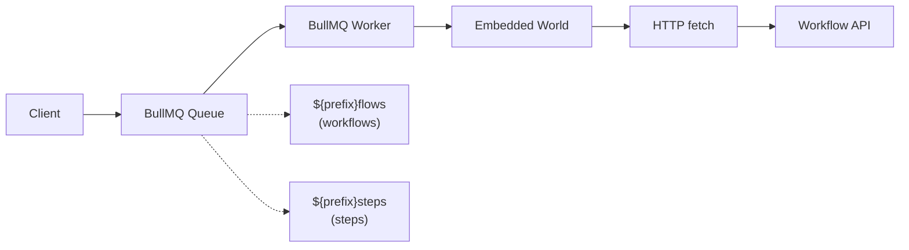
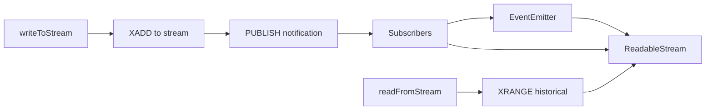

# How Redis World Works

This document explains the architecture and components of the Redis world implementation for workflow management.

This implementation uses **pure Redis** for all storage and operations. It leverages Redis data structures (hashes, sorted sets, streams) for efficient workflow management, BullMQ for job queue processing, and Redis Streams for real-time data streaming.

If you want to use a different Redis client or customize the data structures, you should be able to fork this implementation and modify the storage patterns.

## Architecture Overview

The Redis world consists of four main components:

1. **Storage Layer** - Redis hashes and sorted sets for workflow data
2. **Queue System** - BullMQ for reliable job processing
3. **Streaming** - Redis Streams for real-time data
4. **Embedded World** - Reuses local world for execution

## Storage Layer

### Data Structures

**Workflow Runs**
- Hash: `workflow:run:{runId}` - Stores run data as JSON
- Sorted Set: `workflow:runs:index` - All runs ordered by ULID
- Sorted Set: `workflow:runs:by_name:{workflowName}` - Index by workflow name
- Sorted Set: `workflow:runs:by_status:{status}` - Index by status

**Steps**
- Hash: `workflow:step:{runId}:{stepId}` - Stores step data as JSON
- Sorted Set: `workflow:steps:by_run:{runId}` - Steps for a run, ordered by ULID

**Events**
- Hash: `workflow:event:{eventId}` - Stores event data as JSON
- Sorted Set: `workflow:events:by_run:{runId}` - Events for a run, ordered by ULID
- Sorted Set: `workflow:events:by_correlation:{correlationId}` - Events by correlation ID

**Hooks**
- Hash: `workflow:hook:{hookId}` - Stores hook data as JSON
- String: `workflow:hooks:by_token:{token}` - Maps token to hookId
- Sorted Set: `workflow:hooks:by_run:{runId}` - Hooks for a run

### ULID-based Ordering

All IDs use ULID (Universally Unique Lexicographically Sortable Identifier):
- Monotonically increasing
- Time-ordered
- Used as scores in sorted sets for efficient range queries
- Enables cursor-based pagination

## Job Queue System



### Queue Implementation

- **BullMQ Queues**: Two queues (`{prefix}flows`, `{prefix}steps`)
- **Workers**: Configurable concurrency (default: 10)
- **Job Processing**: Workers deserialize messages and re-queue to embedded world
- **Retry Logic**: 3 attempts with automatic retry
- **Idempotency**: Uses BullMQ jobId for deduplication
- **Job Cleanup**: Keeps last 100 completed, 1000 failed jobs

### Message Flow

1. Client calls `world.queue(queueName, message, opts)`
2. Message serialized with JsonTransport
3. Job added to BullMQ queue with jobId for idempotency
4. Worker picks up job
5. Worker deserializes message
6. Worker re-queues to embedded world
7. Embedded world makes HTTP fetch to execute workflow/step

## Streaming

Real-time data streaming via **Redis Streams** and **Redis Pub/Sub**:



### Stream Implementation

- **Storage**: Redis Streams (`workflow:stream:{name}`)
- **Notification**: Redis Pub/Sub channel (`workflow:stream_notify`)
- **Chunk IDs**: ULID-based for ordering (`chnk_${ULID}`)
- **Data Encoding**: Base64 for binary safety
- **EOF Signaling**: Special chunk with `eof: true`

### How Streaming Works

1. **Writing**: `XADD` appends chunk to stream, then `PUBLISH` notifies
2. **Reading**:
   - Load historical chunks with `XRANGE`
   - Subscribe to real-time notifications
   - Merge historical + real-time in order
3. **Ordering**: ULID comparison ensures correct sequence
4. **Buffering**: Buffer real-time chunks during historical load
5. **Cleanup**: Reference counting for subscriber management

## Setup

Call `world.start()` to initialize BullMQ workers. When `.start()` is called, workers begin listening to BullMQ queues. When a job arrives, workers make HTTP fetch calls to the embedded world endpoints (`.well-known/workflow/v1/flow` or `.well-known/workflow/v1/step`) to execute the actual workflow logic.

In **Next.js**, the `world.start()` function needs to be added to `instrumentation.ts|js` to ensure workers start before request handling:

```ts
// instrumentation.ts

if (process.env.NEXT_RUNTIME !== "edge") {
  import("workflow/api").then(async ({ getWorld }) => {
    // start listening to the jobs
    await getWorld().start?.();
  });
}
```

## Performance Characteristics

### Strengths

- **Fast Reads**: Redis hashes provide O(1) lookups
- **Efficient Pagination**: Sorted sets enable O(log N) range queries
- **Real-time Streaming**: Redis Streams + Pub/Sub for low latency
- **Scalable Queuing**: BullMQ handles high throughput
- **Memory Efficient**: Compact binary serialization

### Considerations

- **Memory Usage**: All data in RAM (configure Redis persistence)
- **Sorted Set Overhead**: Each index adds memory cost
- **Pub/Sub Reliability**: Messages not persisted (use Streams for history)
- **Single-Instance Limits**: For horizontal scaling, consider Redis Cluster

## Data Lifecycle

### Workflow Run Lifecycle

```
create (pending)
  ↓
update (running) - sets startedAt
  ↓
update (completed/failed/cancelled) - sets completedAt
```

### Step Lifecycle

```
create (pending, attempt=1)
  ↓
update (running) - sets startedAt
  ↓
update (completed/failed) - sets completedAt
  ↓
[retry] update (attempt=N)
```

### Stream Lifecycle

```
writeToStream (chunk)
  ↓
writeToStream (chunk)
  ↓
closeStream (eof=true)
```

## Embedded World Pattern

The Redis world uses the **embedded world pattern**:

1. BullMQ workers don't execute workflows directly
2. Instead, they re-queue to an embedded local world
3. Embedded world makes HTTP requests to workflow endpoints
4. This enables:
   - Hybrid architectures
   - World migration
   - Consistent execution model

## Error Handling

- **WorkflowAPIError**: Thrown for not found (404) and conflict (409)
- **Validation**: Entity existence checks before operations
- **Idempotency**: Prevents duplicate runs/steps/hooks
- **Retry Logic**: Built into BullMQ (3 attempts)
- **Worker Errors**: Logged but don't crash worker process

## Monitoring

### CLI Tool

```bash
workflow-redis-setup
```

Shows:
- Connection status
- Redis version
- Existing workflow keys count
- Data structure overview

### RedisInsight

Use RedisInsight (included in docker-compose) to:
- Browse keys and data structures
- Monitor memory usage
- View BullMQ queue metrics
- Inspect stream entries

### Metrics to Monitor

- **Memory Usage**: `INFO memory`
- **Key Count**: `DBSIZE`
- **Stream Length**: `XLEN workflow:stream:{name}`
- **Queue Depth**: BullMQ queue.count()
- **Worker Status**: BullMQ worker events

## Migration from world-postgres

If migrating from world-postgres:

1. Export workflow runs from PostgreSQL
2. Transform to JSON format
3. Import to Redis using pipeline
4. Update `WORKFLOW_TARGET_WORLD` environment variable
5. Restart application with `world.start()`

Note: Data structures are compatible, but storage format differs.
