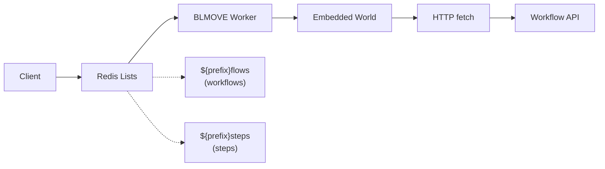
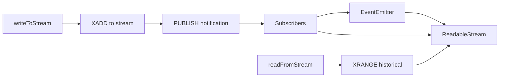

# How Redis World Works

This document explains the architecture and components of the Redis world implementation for workflow management.

This implementation uses **pure Redis** for all storage and operations. It leverages Redis data structures (hashes, sorted sets, lists, streams) for efficient workflow management and real-time data streaming.

If you want to use a different Redis client or customize the data structures, you should be able to fork this implementation and modify the storage patterns.

## Architecture Overview

The Redis world consists of four main components:

1. **Storage Layer** - Redis hashes and sorted sets for workflow data
2. **Queue System** - Redis Lists (LPUSH/BLMOVE) with a durable delayed set for job processing
3. **Streaming** - Redis Streams for real-time data
4. **Embedded World** - Reuses local world for execution

## Storage Layer

### Data Structures

**Workflow Runs**

- Hash: `workflow:run:{runId}` - Stores run data as JSON
- Sorted Set: `workflow:runs:index` - All runs ordered by ULID
- Sorted Set: `workflow:runs:by_name:{workflowName}` - Index by workflow name
- Sorted Set: `workflow:runs:by_status:{status}` - Index by status

**Steps**

- Hash: `workflow:step:{runId}:{stepId}` - Stores step data as JSON
- Sorted Set: `workflow:steps:by_run:{runId}` - Steps for a run, ordered by ULID

**Events**

- Hash: `workflow:event:{eventId}` - Stores event data as JSON
- Sorted Set: `workflow:events:by_run:{runId}` - Events for a run, ordered by ULID
- Sorted Set: `workflow:events:by_correlation:{correlationId}` - Events by correlation ID

**Hooks**

- Hash: `workflow:hook:{hookId}` - Stores hook data as JSON
- String: `workflow:hooks:by_token:{token}` - Maps token to hookId
- Sorted Set: `workflow:hooks:by_run:{runId}` - Hooks for a run

### ULID-based Ordering

All IDs use ULID (Universally Unique Lexicographically Sortable Identifier):

- Monotonically increasing
- Time-ordered
- Used as scores in sorted sets for efficient range queries
- Enables cursor-based pagination

## Job Queue System


```mermaid
graph LR
    Client --> RL[Redis Lists]
    RL --> Worker[BLMOVE Worker]
    Worker --> EW[Embedded World]
    EW --> HTTP[HTTP fetch]
    HTTP --> API[Workflow API]

    RL -.-> F["${prefix}flows<br/>(workflows)"]
    RL -.-> S["${prefix}steps<br/>(steps)"]
```

### Queue Implementation

- **Redis Lists**: Two ready lists (`{prefix}flows`, `{prefix}steps`)
- **Delayed Set**: `{list}:delayed` sorted set scored by deliver-at time — `delaySeconds`, 503 soft retries, and failure backoff all park messages here durably (never in-process timers), so restarts cannot lose deferred deliveries
- **Processing Lists**: Workers BLMOVE into per-worker `{list}:processing:{consumer}` lists; a reclaimer returns entries to the ready list when a worker's heartbeat expires (crash between dequeue and dispatch cannot lose the message)
- **Workers**: Configurable concurrency (default: 10)
- **Idempotency**: Per-key reservations (`{list}:idempotent:{key}`, SET NX with 24-hour TTL), reserved atomically with the enqueue and released on completion or final drop
- **Blocking**: BLMOVE blocks until jobs are available; a lightweight poller promotes due delayed messages

### Message Flow

1. Client calls `world.queue(queueName, message, opts)`
2. Message serialized with a binary-safe JSON transport (Uint8Array round-trips)
3. One atomic Lua call reserves the idempotency key and LPUSHes the envelope (or ZADDs it into the delayed set when `delaySeconds` is set)
4. Worker blocks on BLMOVE, atomically moving the job into its processing list
5. Worker deserializes message
6. Worker makes HTTP fetch to execute workflow/step
7. On success, one atomic Lua call removes the job from the processing list and releases the idempotency key; on 503/failure the job is atomically parked in the delayed set for redelivery

## Streaming

Real-time data streaming via **Redis Streams** and **Redis Pub/Sub**:


```mermaid
graph LR
    Write[writeToStream] --> XADD[XADD to stream]
    XADD --> PUB[PUBLISH notification]
    PUB --> SUB[Subscribers]
    SUB --> EE[EventEmitter]
    EE --> RS[ReadableStream]

    Read[readFromStream] --> XRANGE[XRANGE historical]
    XRANGE --> RS
    SUB --> RS
```

### Stream Implementation

- **Storage**: Redis Streams (`workflow:stream:{name}`)
- **Notification**: Redis Pub/Sub channel (`workflow:stream_notify`)
- **Chunk IDs**: ULID-based for ordering (`chnk_${ULID}`)
- **Data Encoding**: Base64 for binary safety
- **EOF Signaling**: Special chunk with `eof: true`

### How Streaming Works

1. **Writing**: `XADD` appends chunk to stream, then `PUBLISH` notifies
2. **Reading**:
   - Load historical chunks with `XRANGE`
   - Subscribe to real-time notifications
   - Merge historical + real-time in order
3. **Ordering**: ULID comparison ensures correct sequence
4. **Buffering**: Buffer real-time chunks during historical load
5. **Cleanup**: Reference counting for subscriber management

## Setup

Call `world.start()` to initialize queue workers. When `.start()` is called, workers begin blocking on BLMOVE for the Redis Lists (moving jobs into per-worker processing lists), a poller promotes due delayed messages, and a reclaimer recovers jobs stranded by crashed workers. When a job arrives, workers make HTTP fetch calls to the embedded world endpoints (`.well-known/workflow/v1/flow` or `.well-known/workflow/v1/step`) to execute the actual workflow logic.

In **Next.js**, the `world.start()` function needs to be added to `instrumentation.ts|js` to ensure workers start before request handling:

```ts
// instrumentation.ts

if (process.env.NEXT_RUNTIME !== 'edge') {
  import('workflow/api').then(async ({ getWorld }) => {
    // start listening to the jobs
    await getWorld().start?.();
  });
}
```

## Performance Characteristics

### Strengths

- **Fast Reads**: Redis hashes provide O(1) lookups
- **Efficient Pagination**: Sorted sets enable O(log N) range queries
- **Real-time Streaming**: Redis Streams + Pub/Sub for low latency
- **Simple Queuing**: Redis Lists with BLMOVE + processing-list reclaim provide reliable at-least-once processing
- **Memory Efficient**: Compact binary serialization

### Considerations

- **Memory Usage**: All data in RAM (configure Redis persistence)
- **Sorted Set Overhead**: Each index adds memory cost
- **Pub/Sub Reliability**: Messages not persisted (use Streams for history)
- **Single-Instance Limits**: For horizontal scaling, consider Redis Cluster

## Data Lifecycle

### Workflow Run Lifecycle

```
create (pending)
  ↓
update (running) - sets startedAt
  ↓
update (completed/failed/cancelled) - sets completedAt
```

### Step Lifecycle

```
create (pending, attempt=1)
  ↓
update (running) - sets startedAt
  ↓
update (completed/failed) - sets completedAt
  ↓
[retry] update (attempt=N)
```

### Stream Lifecycle

```
writeToStream (chunk)
  ↓
writeToStream (chunk)
  ↓
closeStream (eof=true)
```

## Embedded World Pattern

The Redis world uses the **embedded world pattern**:

1. BLMOVE workers don't execute workflows directly
2. Instead, they re-queue to an embedded local world
3. Embedded world makes HTTP requests to workflow endpoints
4. This enables:
   - Hybrid architectures
   - World migration
   - Consistent execution model

## Error Handling

- **Error taxonomy**: The specific `@workflow/errors` classes core discriminates by name — `EntityConflictError` (duplicate creations, terminal-state conflicts), `RunExpiredError` (operations on terminal runs), `TooEarlyError` (step retry backoff not reached), `WorkflowRunNotFoundError`, and `HookNotFoundError`
- **Validation**: Entity existence and terminal-state checks before operations; entity transitions use compare-and-swap Lua scripts so concurrent events cannot overwrite each other
- **Idempotency**: Creation events write entity + event in one atomic Lua script; duplicates reject with `EntityConflictError` so the event log holds exactly one creation event
- **Worker Errors**: Logged but don't crash worker process (workers retry BLMOVE after 1s delay on error); in-flight messages survive crashes via processing-list reclaim

## Monitoring

### CLI Tool

```bash
workflow-redis-setup
```

Shows:

- Connection status
- Redis version
- Existing workflow keys count
- Data structure overview

### RedisInsight

Use RedisInsight (included in docker-compose) to:

- Browse keys and data structures
- Monitor memory usage
- View Redis List lengths
- Inspect stream entries

### Metrics to Monitor

- **Memory Usage**: `INFO memory`
- **Key Count**: `DBSIZE`
- **Stream Length**: `XLEN workflow:stream:{name}`
- **Queue Depth**: `LLEN workflow_flows` / `LLEN workflow_steps`
- **Worker Status**: Monitor logs for BLMOVE worker activity

## Migration from world-postgres

If migrating from world-postgres:

1. Export workflow runs from PostgreSQL
2. Transform to JSON format
3. Import to Redis using pipeline
4. Update `WORKFLOW_TARGET_WORLD` environment variable
5. Restart application with `world.start()`

Note: Data structures are compatible, but storage format differs.
